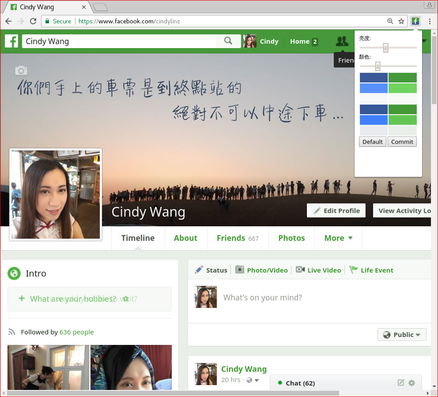

這是一個綠化 Facebook 畫面的 Chrome extension. 安裝後, Facebook 的畫面就會變成類似下面這樣~

[從 Chrome web store 安裝](https://chrome.google.com/webstore/detail/kiakheiecijiajkikjkajibfppjialoc/)

從 [Ronny Wang](https://www.facebook.com/ronny.wang.tw) 得來的靈感~ ^^

---

# Making-of

起初創作 GreenifyFacebook 的時候, 沒有想過會有人拿它來用, 一開始我只是要拿來笑的...... 我在更之前兩天看了國民黨很認真地瞎鬧, 或說是瞎鬧得很認真, 而且越演越烈越鬧越誇張, 處於一種不知道該說什麼, 這時候只能傻笑了的狀態..... 到了星期五半夜看到了 [Ronny Wang](https://www.facebook.com/ronny.wang.tw) 貼的瞎鬧 script, 心念一動, 既然只能笑了, 那就好好地痛快地笑一場吧......

第一個版本寫得很簡陋 (被轉貼的截圖多是這個版本w), 遇到覺得處理起來正解有點麻煩的部分就跳過或亂做, 有些圖示沒有改, 而且有些顏色會變成刺眼的螢光綠, 寫一個小時多一點就收工了. 反正只是笑料嘛, 幹嘛那麼認真XD 草草發佈以後在 FB 上嚷嚷一下打算放置著給大家一起笑就去睡覺了... 早上去 [鮑毅超](https://www.facebook.com/dropdavid) 的咖啡店聊天時, 他說裝了這個以後用起來感覺不錯, 真是嚇了一跳竟然有人會想用....XD 於是我晚上回家以後好好地裝著它用一陣子, 才開始了認真改進修整程式的過程 ^^|

  * v1.0

    這個簡陋的版本作了兩個動作, 一個是 FB 頁面載入後從 stylesheet 裡面找出所有的 color, background-color, border-color 三種 property, 用某個方式判斷它是不是「藍色系」的, 如果是的話就把它轉變為「綠色系」; 另一個是用眼睛大略找找網頁裡出現的藍色系的 icon, 把圖檔下載下來用 [gimp](https://www.gimp.org/) 改成綠的存在 extension 資源檔裡面, 然後把引用的圖檔換掉..

    判斷顏色系的「某個方式」是把原本的 RGB 顏色表示法轉換為 [HSV](https://en.wikipedia.org/wiki/HSL_and_HSV) 顏色表示法, 其中 HSV 的 S 和 V 是彩度和亮度我不去管它, 而 H 就會表示我想處理的顏色色系了. FB 用的各種藍色, 其 H 值剛好都是 61.29% 左右, 而 30% 附近是綠色的範圍, 所以我把 H 值範圍在 45%~75% 的列入守備範圍 (在 v1.1 時改成 50%~70%), 把它的 H 值 - 30% 再轉換回 RGB 填回去.. 其中 messenger 裡出現的螢光綠就是這樣來的, 同樣的亮度彩度在藍色不是螢光, 改成綠色就變螢光了...^^|

    而 icon 的部分, 除了我換的圖檔不夠全面以外, FB 出 icon 的圖檔網址貌似會以不知名的方式變動, 所以因為我用網址來判斷要不要換掉, 而造成有時候就算我有準備好的圖, 卻仍沒有正確換掉它...
    草草發佈, 沒有 logo, 分類選「fun」, 給大家笑..XD

  * v1.1

    這一個版本處理了換圖的問題. 我把事先準備好的圖檔都移除掉, 讓我的程式從 stylesheet 裡面找出會被當 icon 用的 background-image, 直接去讀取並修改這張圖.

    FB 拿 background-image 作 icon 使用的時候, 是在一張圖檔裡面集合了好幾個 icon, 而使用的時候再露出不同的部位, 我只想改掉藍色系的 icon, 保留其他的 icon 不要動, 不然如果整張圖都作轉換的話, 表情符號裡的哭臉, 黃色臉龐掛著的藍色淚珠會變成綠色淚珠, 那就很詭異了. 所以我打算找出一個個 icon 的範圍, 然後判斷 icon 內所有的畫素是不是全都是由藍色系或是超低彩度 (黑白灰) 構成, 是的話才把其中的藍色系畫素變成綠色系畫素..

    不過在 stylesheet 裡面只看得出引用時的左上角坐標, 看不出引用時的範圍, 我只能從圖片的內容判斷看看.. 我一開始猜想所有的 icon 的長跟寬都是一樣的, 所以我就從指定的坐標開始拉正方形, 看拉到多大的時候不會再壓到不透明的畫素, 不過寫完跑下去才發現其實有很多長長扁扁的 icon, 它會讓我畫出來的區域納入太多別的 icon; 也有破碎成好幾塊的 icon, 它讓我只有處理到最左上角的那一個碎片.. 想了一想我換了一個方法, 我不再管引用的位置在哪裡, 我直接找出圖檔裡面一個一個連通的不規則形區域, 以區域為單位來判斷, 而那個形狀破碎的 icon, 在此時就會視為好幾個獨立的區域分別處理這樣..

  * v1.2

    這一個版本處理兩個問題, 一個是惱人的螢光綠, 另一個是切換畫面以後, 新出現的 stylesheet 還沒有處理.

    我觀察螢光綠的 HSV 值, 發現它的 S 值 65% 左右, V 值是 100%. 所以我第一個想法是限制 V 值的大小, 我試了一下, 覺得把它限制在 87% 不能再高似乎不錯又有梗.. 沒想到實裝以後發現這樣造成原本淡綠色的底色變得很暗沈, 原來它原本的 V 值高達 93%, 但 S 值只有 2.1%.. 於是我再把限制條件改成 SxV 要在 45% 以下, 如果超過的話, 就把超過的倍率取平方根以後均勻調件 S 與 V 的倍率..

    而新冒出的 stylesheet 的問題, 我找到了一個叫作 MutationObserver 的東西, 可以用來監看 &lt;head&gt; 裡面有沒有新的 element 跑出來, 有的話就再去追殺一次新來的 stylesheet.

  * v1.3 與 v1.4

    既然發現有 MutationObserver 可以用了, 它除了可以監看新增的元件以外, 也可以監看元件的屬性變化, 所以我也可以拿它來追殺變化了的 inline style. 加上這個功能以後就可以讓自己點讚以後的提示文字的顏色也納入處理了..

    v1.3 與 v1.4 的差異是 v1.3 的寫法有些情況會漏掉.

  * v1.5

    這一版作了三件事, 一個是把瀏覽器頁籤裡的 FB 小圖示改掉, 一個是加上可以自行調整亮度的控制介面, 最後, 我終於做了 logo..XD

    處理小圖示的方式就是用程式把小圖示下載下來, 抹綠(?), 然後再把原本的 &lt;link rel="shortcut icon" ...&gt; 關掉, 改成自己改過的版本放回去.

    調整亮度的介面我想了一陣子, 怎麼樣才能明確表達給使用者他調整的程度到哪裡了, 如果只是顯示一個 V 值乘以 S 值的數值應該是一點感覺都沒有.. 最後我決定把原本藍色調的 FB 裡面抽取幾個有代表性的藍色出來, 在控制介面裡並列著呈現對應轉換後的綠色是什麼..

    Logo 的部分, 原本是想直接把藍色的 FB logo 換成綠色.. 不過就要動手的時候想到, 如果作成把綠色液體淋在 FB logo 上面慢慢流下來, 呈現把整個 logo 染綠的現在進行式好像不錯, 於是就用 gimp 畫成現在這樣了 ^^

  * v1.6

    這版本是在控制介面裡指定好語系, 因為有的人語系跑掉, 使得提示的文字變成亂碼了..

  * v1.7

    這一版改善效能, 改正 MutationRecord 的用法, 有元件的 attributes 改變時, 就只處理這個元件而不連帶處理它裡面的所有子元件.

    避免處理 domain 不同的背景圖檔, 也省一些時間.

  * v1.8

    將更多 CSS properties 納入處理範圍, 並且加入處理 CSS animation keyframes 裡的 styles. 點文章的「時間」的時候會進入顯示該篇文章的畫面, 而剛載入的時候會出現藍色框框若干秒鐘再退去... 這一版會把它變成綠色的.

  * 未來待解的問題

      - 我發現抓 icon 圖檔的動作有時候會失敗, 這個待解決
      - 沒有處理單個的 &lt;img&gt; 圖檔和 SVG, 所以有些 icon 還沒處理到
      - 有人想用別的顏色, 以現在的程式寫法來說, 剛好蠻容易加的, 可是這 extension 就是要作為臉書是綠色的證據啊... 所以我還在糾結
      - MutationObserver 的使用我還不太熟悉它的性質, 我的用法有可能做了太多的動作, 使得留言量整個展開 (可能六七百則) 的時候會覺得展開的動作有點卡... 這個要確認一下
      - Firefox Add-on.. 我還不會寫, 聽說跟 chrome extension 寫法很像, 也許來學一下..

    這個 extension 是開 MIT license 的, 所以以上的東西, 有興趣的朋友都可以接著改~~ ^^
